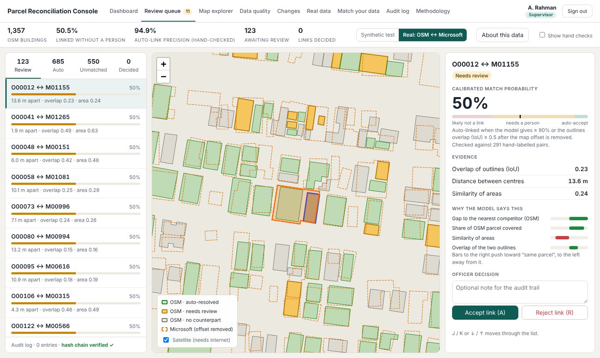
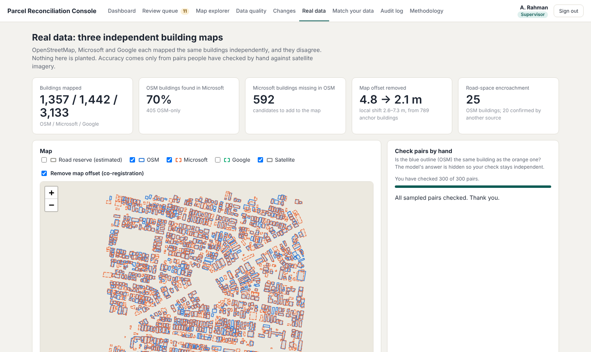
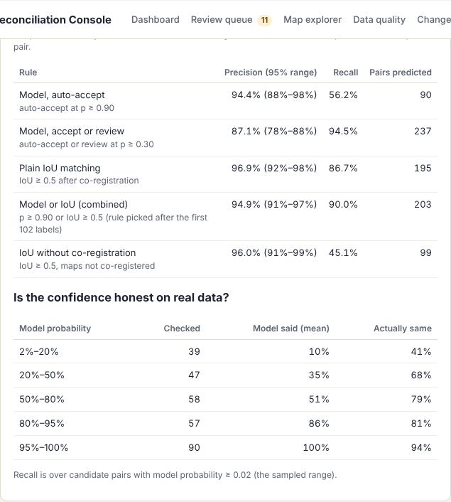
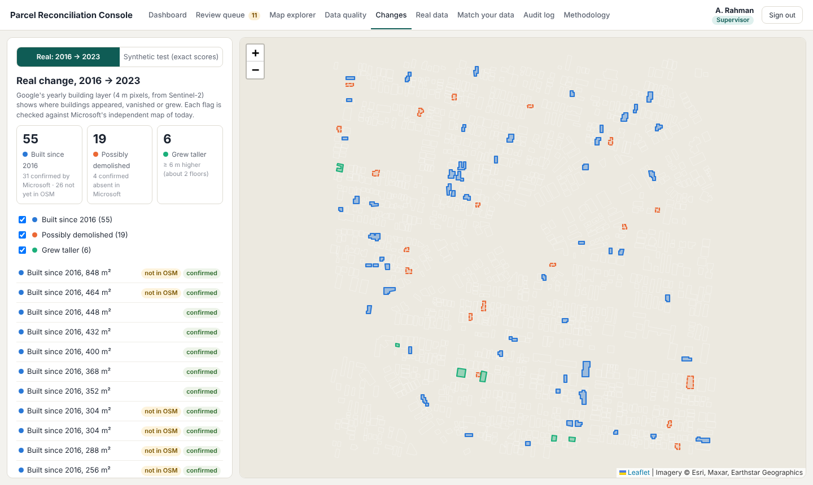
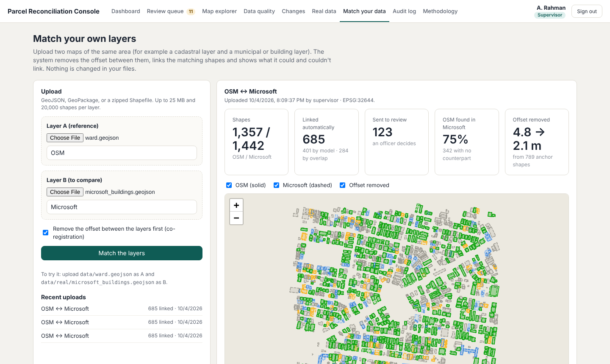
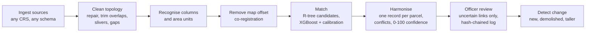

# Parcel Reconciliation Console

**Smart India Hackathon 2026 · Problem statement SIH26013** — *Automated Integration and Intelligent Harmonization of
Multi-source Geospatial Data for Urban Land Record Management* (Ministry of Rural Development, Smart Automation).

Cities hold the same land in several records that never quite agree: a cadastral survey, revenue (patta) records,
municipal tax rolls, newer building maps. Each uses its own coordinate system, column names and units, and they
are offset from one another by metres. This console brings such layers together: it removes the offset between
maps, links the records that describe the same parcel or building, flags conflicts, gives every link a calibrated
confidence, and sends only the uncertain cases to an officer, with every decision kept in a tamper-evident log.

**What sets it apart: it is tested on real maps, not only on data we generated.** 300 pairs from two independent
real building maps of T. Nagar, Chennai, were checked by hand against satellite imagery, and the console reports
its accuracy against those checks, with confidence ranges.



---

## Results at a glance

### On real maps (OSM ↔ Microsoft building footprints, T. Nagar, Chennai)
300 candidate pairs, sampled across all confidence levels, checked blind (the model's answer hidden) against satellite
imagery; median 5 seconds per pair, and the system refuses answers given in under 3 seconds. 291 decided, 9 "can't tell".
Figures are weighted back to all candidate pairs; ranges are 95% Wilson intervals.

| Matching rule | Precision | Recall |
|---|---|---|
| Outline overlap (IoU ≥ 0.5), maps **not** co-registered | 96.0% (91–99%) | 45.1% |
| Outline overlap (IoU ≥ 0.5) **after co-registration** | 96.9% (92–98%) | 86.7% |
| Model only, auto-accept (p ≥ 0.90) | 94.4% (88–98%) | 56.2% |
| **Model or overlap — the console's rule** | **94.9% (91–97%)** | **90.0%** |
| Model, auto-accept or send to an officer (p ≥ 0.30) | 87.1% | 94.5% |

- **Co-registration doubles real-world recall** (45% → 87%) at the same precision. The two maps are offset by
  2.6–7.3 m, varying across the ward; the console estimates that shift from 789 anchor buildings and removes it
  (median offset 4.8 m → 2.1 m).
- **The model alone is precise but cautious on real data.** It was trained only on synthetic errors, which differ
  from how real maps disagree, so the console combines it with the overlap rule and officer review.
- On the 198 pairs checked *after* the combined rule was chosen, it scored 93.8% precision and 87.0% recall.

### Real change, 2016 → 2023 (Google Open Buildings Temporal)
| Change | Found | Checked against Microsoft's independent map |
|---|---|---|
| Built since 2016 | 55 | 31 confirmed · **26 not yet in OpenStreetMap** |
| Possibly demolished | 19 | 4 confirmed absent (weaker signal, labelled as such) |
| Grew ≥ 6 m taller (≈ 2 floors) | 6 | field check needed |

### Synthetic stress tests (real footprints, planted errors, exact answers)
Real OSM footprints of the ward are the truth; a second layer is made from them with labelled errors (shifts,
rescaling, rotation, splits, merges, missing and spurious parcels, owner-name variants). Spatial out-of-fold, 4 folds.

| | Calibrated model | IoU baseline |
|---|---|---|
| Auto-accept precision | 98.2% | 98.8% |
| Auto-accept recall | 95.6% | 56.6% |
| Auto-accept F1 | 96.9% | 71.9% |
| Parcels resolved with no officer | 99.0% | 72.9% |

On a harsher error profile the model never saw, F1 is 96.7% (IoU baseline 70.7%); across 5 random seeds the
auto-accept precision averages 99.7%. Removing owner names from the features changes nothing, so the score does
not lean on the synthetic names.

---

## Screenshots

| | |
|---|---|
|  |  |
| **Real data**: OSM, Microsoft and Google compared; offset removed; pairs checked by hand | **Accuracy on real data**, and whether the model's confidence is honest |
|  |  |
| **Changes**: real 2016 → 2023, each flag checked against an independent map | **Match your data**: upload two layers, get links in about 2 seconds |

---

## Run it

### One command (Docker)
```bash
docker compose up --build
```
Open <http://localhost:8000>. The image includes the prebuilt results and the trained matcher. Decisions, hand
checks, uploads, users and the access log are kept in a Docker volume and survive restarts.

### Without Docker (Windows, macOS, Linux; Python 3.10+)
```bash
pip install -r requirements.txt
python scripts/serve.py            # http://127.0.0.1:8000
```
Works offline except for the satellite and street basemaps (the map library is bundled).

### Demo accounts
Created on first run. **Disable them in Administration before any real use.**

| Role | Login | Lands on | Can |
|---|---|---|---|
| Revenue officer | `officer1` / `officer@123` | Review queue | decide flagged links, check pairs by hand, upload layers |
| Supervisor | `supervisor` / `super@123` | Dashboard | everything an officer can, plus change a recorded decision (with a written reason), audit log, exports, ground truth |
| Auditor | `auditor` / `audit@123` | Audit log | read-only: audit trail, tamper check, exports |
| Administrator | `admin` / `admin@123` | Administration | add or disable users, sign-in history, data status; cannot decide links |

### A five-minute demo
1. Sign in as **supervisor**. The **Dashboard** shows the synthetic benchmark and every module's numbers.
2. **Review queue → Real: OSM ↔ Microsoft.** Pick a pair: map, evidence, why the model says so. Tick
   *Show hand checks* to see the human answer. Accept or reject; the footer shows the audit chain verified.
3. **Real data.** Untick and tick *Remove map offset* to show the correction; scroll to the hand-checked accuracy.
4. **Changes → Real 2016 → 2023.** Buildings built since 2016 that OpenStreetMap still lacks.
5. **Match your data.** Upload `data/ward.geojson` and `data/real/microsoft_buildings.geojson`.
6. **Audit log.** Edit a line of `demo/decisions.jsonl` and watch the console report tampering.

---

## How it works



| Step | What it does | Code |
|---|---|---|
| Ingest | GeoJSON, GeoPackage or Shapefile in any coordinate system, converted to a metric working CRS (tested with UTM 44N, India NSF LCC EPSG:7755 and WGS 84; round-trip error under 1 mm) | `integrate.py`, `realmatch.py` |
| Topology | invalid shapes repaired, overlaps trimmed in favour of the better-supported parcel, slivers removed, near-miss gaps flagged (synthetic revenue layer: 467 → 7 errors) | `topology.py` |
| Columns and units | matches columns by name and by the values they contain; infers area units (cents, square feet, grounds…) from the data itself (9/9 columns, both units correct) | `attributes.py` |
| Co-registration | mutual-nearest anchor shapes → robust global shift → local shift field from the nearest 25 well-overlapping anchors, iterated | `coreg.py` |
| Matching | R-tree candidates within 30 m; 12 geometry features (overlap, containment, centroid distance, area ratio, Hausdorff, rank and gap to competitors); XGBoost (300 trees, depth 4) with isotonic calibration; thresholds chosen on separate spatial blocks for a target precision; one-to-many relations found when one map draws a terrace as a single shape | `features.py`, `ml.py`, `realmatch.py` |
| Explanations | per-link feature contributions (TreeSHAP) shown to the officer | `api.py`, `review.html` |
| Harmonise | one record per parcel; geometry from the survey, owner and extent from revenue, use from tax; conflicts flagged (owner P 91% R 91%, area P 90% R 100%, land use P 96% R 89% on planted conflicts); confidence = 100 × spatial × source reliability × topology × attributes | `integrate.py` |
| Change | synthetic: the matcher on a later survey (new / demolished / altered precision 94 / 93 / 100%, recall 100 / 100 / 95%). Real: Google's 2016 and 2023 building layers, drift-corrected, confirmed against Microsoft | `changes.py`, `temporal.py` |
| Road encroachment | buildings overlapping the estimated road reserve (OSM road class and width tags); 25 OSM buildings, 20 confirmed by a second source; field-check candidates only | `build_real.py` |

**Security and audit.** Sessions are HMAC-signed cookies (8 hours); passwords are salted PBKDF2 (200,000 rounds);
five wrong passwords lock a username for five minutes; roles are enforced by the API (401/403), not only hidden in
the pages. Every decision is appended to `demo/decisions.jsonl`, where each entry commits to the SHA-256 of the one
before, so any edit or deletion is detected. Repeating a decision is a no-op; only a supervisor can change one, with
a written reason, at most three times.

---

## Reproduce the results

```bash
# 1. a ward of real OSM buildings (T. Nagar)
python scripts/fetch_osm.py --bbox 13.0400,80.2300,13.0500,80.2400 --out data/ward.geojson

# 2. synthetic benchmark + all modules -> demo/  (keeps existing decisions)
python scripts/build_demo.py --input data/ward.geojson
python scripts/robustness.py --input data/ward.geojson --save demo/robustness.json
python scripts/shift_check.py --input data/ward.geojson --save demo/shift.json

# 3. real data: Microsoft footprints + OSM roads and land use
python scripts/fetch_real.py --bbox 13.0380,80.2330,13.0480,80.2430
#    Google Open Buildings (polygons + 2016/2023 temporal rasters): run scripts/gee_google_buildings.js
#    in the Earth Engine Code Editor and save the exports to data/real/
python scripts/build_real.py          # co-registration, matching, sample for hand checks, change -> demo/real/

# 4. tests (40)
python -m pytest -q
```
All thresholds, error mixes and weights live in `config/policy.yaml`. Hand checks are made on the **Real data**
page and stored in `demo/real/labels.jsonl` (with the time each one took).

---

## Repository layout
```
config/policy.yaml        thresholds, error profiles, source reliability, confidence bands
src/recon/
  footprints.py inject.py profiles.py   real footprints and the planted-error benchmark
  features.py ml.py evaluate.py         candidate pairs, features, XGBoost + calibration, scoring
  coreg.py realmatch.py                 co-registration and real-layer matching (also used by uploads)
  topology.py attributes.py integrate.py changes.py temporal.py   the integration modules
  realeval.py                           weighted accuracy from hand checks, Wilson intervals
  auth.py api.py                        users, roles, sessions; FastAPI service
scripts/                  fetch_osm, fetch_real, gee_google_buildings.js, build_demo, build_real,
                          robustness, shift_check, run_benchmark, serve
ui/                       console pages (plain HTML + Leaflet, no build step)
demo/                     prebuilt results; decisions, users, labels and uploads are written here
tests/                    benchmark integrity, leakage guards, modules, API, roles, uploads, real data
Dockerfile, docker-compose.yml
```

### Console pages
| Page | For |
|---|---|
| Dashboard | headline numbers, module results, ward map, model vs baseline, calibration |
| Review queue | flagged links one by one, synthetic or real; evidence, explanation, accept / reject |
| Map explorer | any parcel or building and all its candidate links, synthetic or real |
| Data quality | topology before/after, column and unit recognition, conflicts, confidence |
| Changes | real 2016 → 2023, or the synthetic later survey with exact scores |
| Real data | three real maps compared, offset removal, hand checks, accuracy, encroachment |
| Match your data | upload two layers and link them |
| Audit log | full decision history, tamper check, CSV / JSONL download |
| Methodology | pipeline, real and synthetic test results, settings, limits |
| Administration | users, sign-in history, data status |

---

## Limits (please quote these with the results)
- Real-data accuracy comes from **one dense ward** (about 1,400 buildings) and from **building footprints**, not legal
  parcel boundaries. Other areas and real cadastral records are not yet measured; the method is built for both.
- 300 hand checks were made by one person; a second checker would give an agreement figure (the page supports it).
- Owner names, areas, land use, tax records and the synthetic later survey are generated with planted conflicts;
  real departmental data will be messier.
- The model was trained on synthetic errors and is cautious on real maps; recalibrating it with officer checks is the next step.
- Google's yearly building layer is itself a model output (4 m, from Sentinel-2); change flags are field-check candidates.
- Demo accounts and the signing secret in `demo/` are for the demo only.

## Data and credits
- Building footprints and roads © [OpenStreetMap](https://www.openstreetmap.org/copyright) contributors, ODbL.
- [Microsoft Global ML Building Footprints](https://github.com/microsoft/GlobalMLBuildingFootprints), ODbL.
- [Google Open Buildings](https://sites.research.google/gr/open-buildings/) v3 and
  [2.5D Temporal](https://developers.google.com/earth-engine/datasets/catalog/GOOGLE_Research_open-buildings-temporal_v1),
  CC BY 4.0 / ODbL; the temporal layer contains modified Copernicus Sentinel-2 data.
- Satellite basemap: Esri World Imagery (Esri, Maxar, Earthstar Geographics), loaded live in the browser, not redistributed.
- Map library: [Leaflet](https://leafletjs.com/) (BSD-2).
